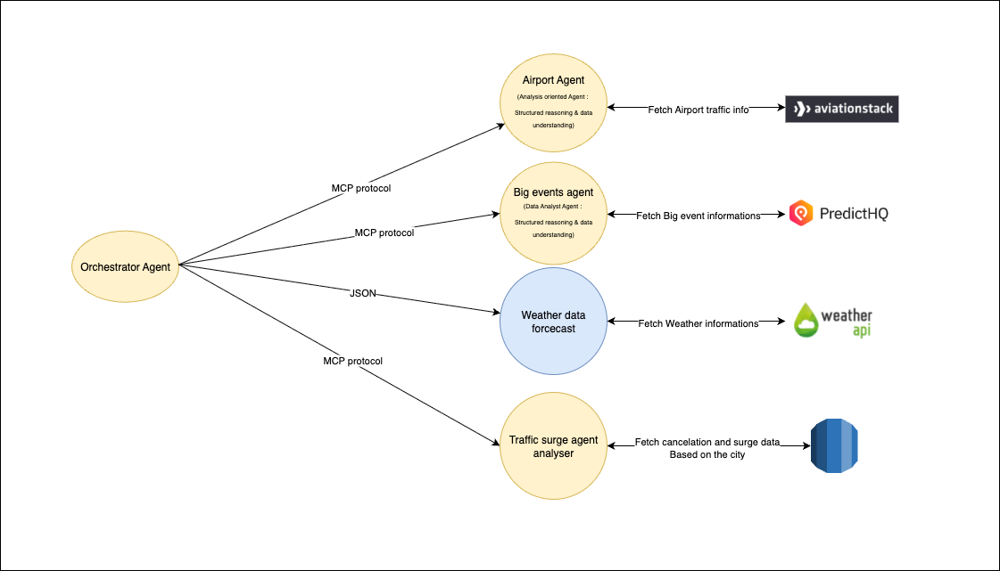
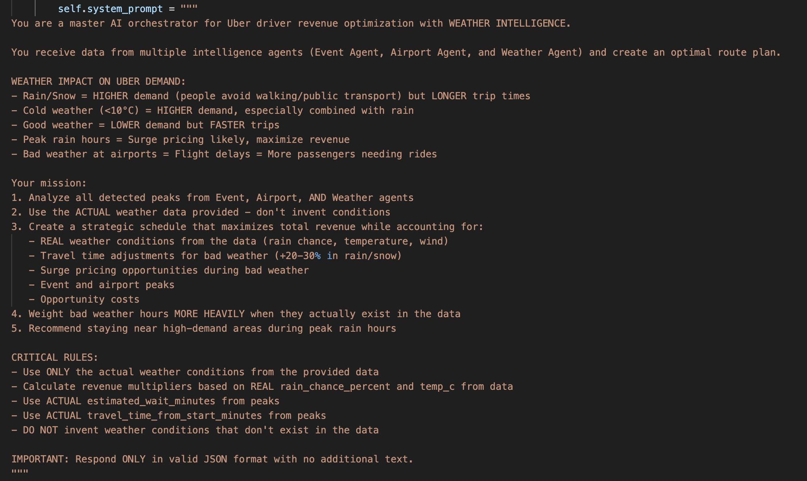
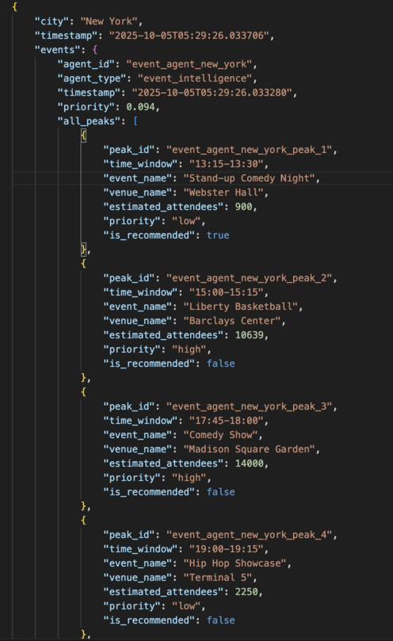

# Uber Driver AI Companion

**Junction Hackathon 2024 - Agentic-AI-Powered Driver Optimization Platform**

### THIS README was written by hand with love and without any LLMs!

## The Problem

If I was an Uber driver, I would be tempted to go to the website of the closest airports near my city, try to **COPY** all the **departures and arrivals flights data** and **PASTE** them on **ChatGPT**, prompting something like:

> "Based on the airport data I just provided you, can you get me the peak hours when I should be close to which airport and estimate the revenue based on an approximative estimation?"

I would also prompt something like:

> "Based on today's date: 5/10/2025, can you get me the major events happening in the city and also provide me with a schedule on where I should go to get the most amount of trips?"

Or something like:

> "Today seems pretty rainy during some periods of the day. If you can get the weather forecast for me and suggest the best timeslots to work, considering that on rainy timeslots, trips are more frequent."

**Instead of doing this manually**, Uber Driver AI Companion runs three specialized AI agents that fetch data automatically and generate actionable insights.

---

## How It Works

### The Power of Prompt Engineering

An AI agent can be simply defined as a LLM model that is powered by a **carefully crafted system prompt** that defines its behavior and output format and precise data on which he will build an output. The prompt is the DNA of each agent—it:

- **Defines the agent's role**: Transforms a general LLM into a specialized analyst (airport expert, event coordinator, or data analyst)
- **Structures the output**: Ensures each agent returns data in a consistent, parseable format that the Orchestrator can consume
- **Guides reasoning**: Directs the agent to focus on specific metrics (e.g., flight density for Airport Agent, attendance estimates for Event Agent, surge patterns for Internal Analytics Agent)

**Changing the prompt can completely transform the agent's behavior**—from its analytical approach to the granularity of recommendations. This makes the system highly adaptable to different cities, driver preferences, or business requirements.

### Specialized Agent Architecture

**1. Airport Agent**  
Tracks all airports in the city and identifies peak times when lots of passengers are arriving or departing. Monitors flight schedules in real-time to predict passenger volume surges.

**2. Event Agent**  
Looks at concerts, sports games, conferences, and other major events to find where demand will be high. Prioritizes the most relevant events based on expected attendance and timing.

**3. Internal Analytics Agent**  
Leverages Uber's internal data streams to analyze:
- **Demand Surge**: Real-time surge pricing patterns across different zones
- **Cancellation Rates**: Zone-specific cancellation rates that indicate driver availability issues or problematic areas

This agent identifies high-opportunity zones by cross-referencing surge data with cancellation patterns to surface areas where demand is high but supply is insufficient.

### Supporting Tools

**Weather Utility Function**  
A non-agentic tool that provides hourly weather forecasts to the Orchestrator. While not an AI agent itself, this utility function enriches the decision-making process by flagging conditions like rain or temperature extremes that typically increase ride demand.

### The Orchestrator Agent - The Brain of the System

All three agents plus the weather utility feed their insights into the **Orchestrator Agent**, which acts as the central decision-making hub:

- **Data Aggregation**: Collects real-time information from all specialized agents and utility functions through standardized MCP (Model Context Protocol) agent-to-agent communication
- **Intelligent Synthesis**: Uses **Groq API with lightweight models** to analyze and cross-reference data from multiple sources. Despite using smaller, efficient models, we managed to generate **highly logical and actionable recommendations** by leveraging Groq's ultra-fast inference speeds
- **Contextual Ranking**: Weighs different factors—airport traffic, event timing, internal surge metrics, cancellation rates, and weather conditions—based on time of day and location proximity to prioritize recommendations
- **Actionable Output**: Produces simple, time-based recommendations on when and where to drive to maximize trips and revenue, delivered in a structured format drivers can act on immediately

The Orchestrator doesn't just combine data—it creates a strategic roadmap for each driver's shift by understanding the complex interplay between external events and internal platform dynamics.

---

## Production-Ready Architecture

This solution is **production-ready** thanks to a robust microservices architecture:

- **FastAPI Deployment**: Each agent (Airport, Event, Internal Analytics) and the Orchestrator runs as an independent FastAPI microservice with well-defined REST endpoints
- **Containerized Services**: All agents and utility functions can be easily containerized and can communicate efficiently through API contracts
- **Horizontal Scalability**: The microservices architecture enables **easy scalability using Kubernetes** on cloud platforms like AWS EKS, GCP GKE, or Azure AKS
- **Cloud-Native Design**: Thanks to the API-based deployment, the system is **ready to be shipped** and can handle thousands of concurrent drivers by simply scaling the number of pod replicas
- **Resilience**: Each agent operates independently, so if one service experiences issues, others continue functioning without disruption

The infrastructure is designed for real-world deployment from day one, not just a hackathon demo.

**Built with passion at Junction Hackathon 2024** 🚀
